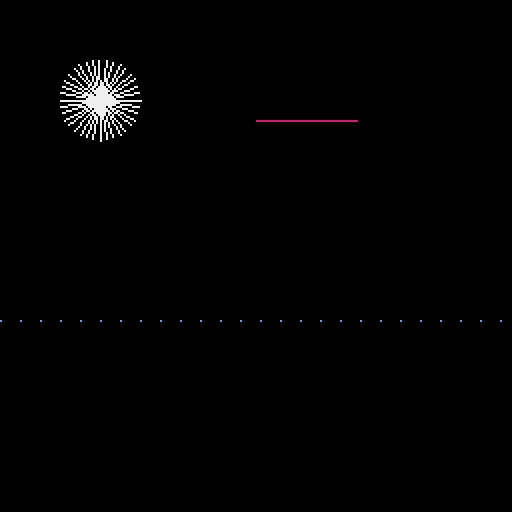
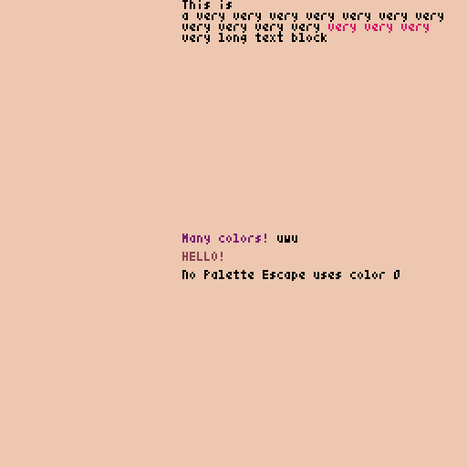

**PyxelExt** are lazy Pyxel extensions.

This is my personal collection of functions that I need, or _might need_ for my game(s).

## Install

    pip install pyxelext
    
## Functions

### Take a look in `pyxelext/examples`

`# pyxelext/line.py`
```python
from pyxelext.line import *
line(x1: int, y1: int, x2: int, y2: int, col: int)  # like pyxel.line but returns length of the line in pixel
aline(x: int, y: int, length: int, col: int, angle: int = 0)
poly(*args: ((int, int),), col: int)  # draw a polygon
```



`# pyxelext/input.py`
```python
from pyxelext.input import *
btn_pressed()  # returns button that is currently pressed
```

`# pyxelext/text.py`
```python
from pyxelext.text import *
text(x: int, y: int, txt: str)  # pyxel.text but with inline text palette support
textblock(x: int, y: int, txt: str, nl_px: int = 6, drop_whitespace: bool = True)  # Text block with screen wrap
```



